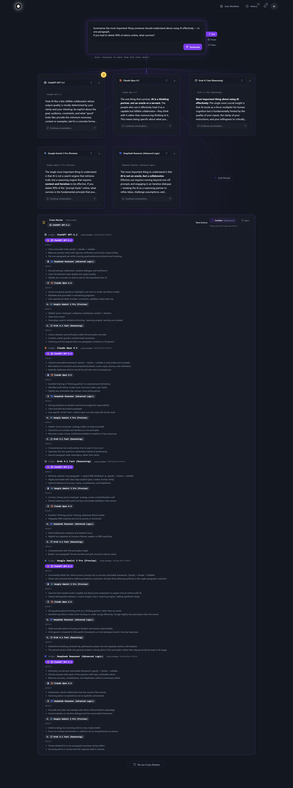
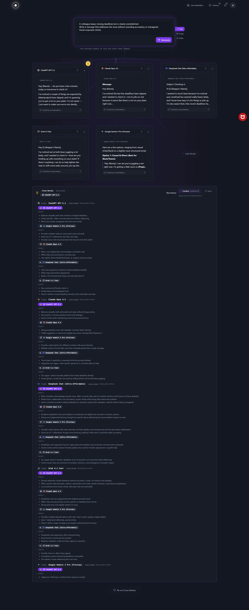
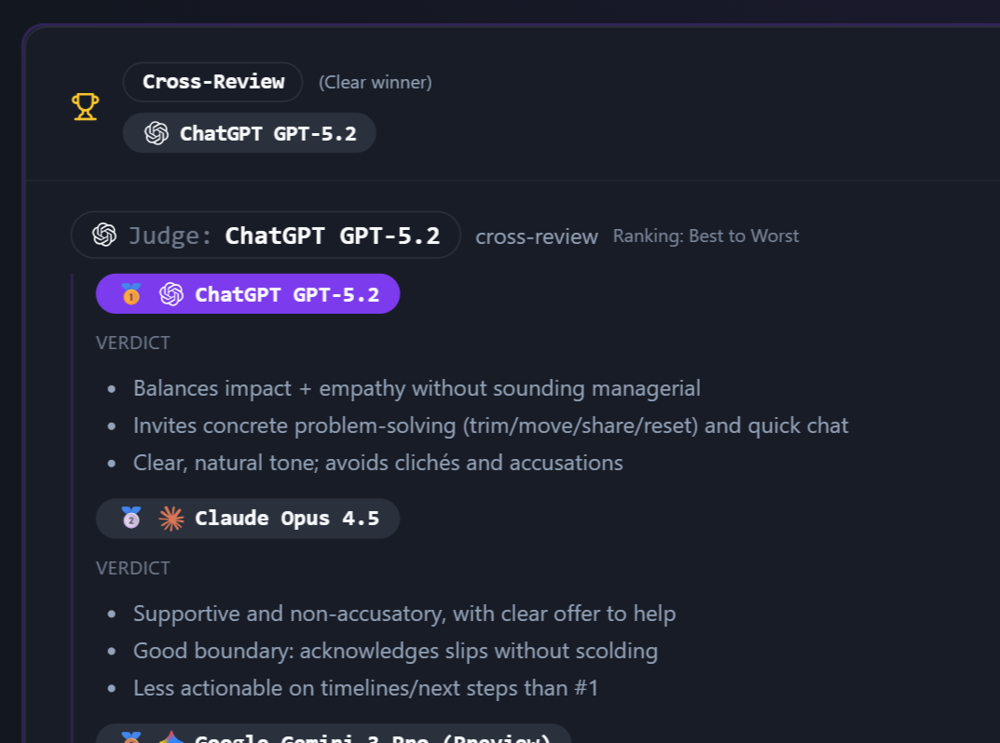

# ChatSpread

> Multi-provider LLM comparison platform with an LLM-as-judge evaluation layer.

**Live:** [chatspread.com](https://chatspread.com) | **Users:** 100+

## What it does

Lets you query multiple LLMs (OpenAI, Anthropic, Google, open-source) with a single prompt and see responses side-by-side. An LLM-as-judge layer automatically evaluates response quality so you can pick the best model for each use case at a glance.

## Features

- Side-by-side multi-provider response comparison
- Automated quality ranking via LLM-as-judge
- Streaming responses from all providers
- Per-query cost tracking
- Razorpay-backed subscription tiers

## Stack

- Front-end: React
- Back-end: Node.js
- Payments: Razorpay
- LLM APIs: OpenAI, Anthropic, Google Gemini, open-source models

## Screenshots

### Multi-model comparison

Fan out a prompt to multiple models at once, and view their responses side-by-side.

### Judge rankings

Cross-review layer where each model judges every other model's output, ranked best to worst with verdicts.

### Winner card

Clear winner surfaced at the top of every workflow, with medal ranking across models.

## Why I built this

Picking the right LLM for a task used to mean running the same prompt across three or four providers by hand and eyeballing the differences. ChatSpread collapses that loop into one call, adds a judge layer so the ranking is consistent, and keeps a history of prompts and costs so I can revisit decisions later.

---

Built by [Harshdeep Singh](https://github.com/travellingdev). Part of a series of products at [chatspread.com](https://chatspread.com), [indianfoodnearme.co](https://indianfoodnearme.co), and [collabscene.com](https://collabscene.com).
